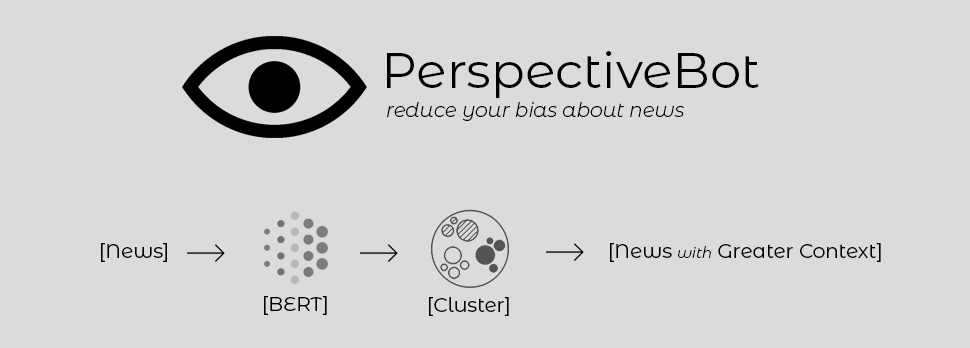

# :eyes: Perspective Bot
> Are we even aware of our biases anymore? It needs to be fixed.
> If you look at this chart and are convinced your “extreme” source belongs in the middle, you just might be part of the problem.

**Perspective Bot** is a Chrome Extension where we can input the news we hear about to get more context about it. Using Machine Learning algorithms like BERT (Bidirectional Encoder Representations from Transformers) and clustering, the bot can show different perspectives about the news grouped by countries with the most hits about the news. 

### Problem Statement
Lorem Ipsum

### Solution
Lorem Ipsum

### Screenshots
Lorem Ipsum

### Installation
Lorem Ipsum

### Team
1. [Rahul Bhattacharjee](https://github.com/rahulbhatta)
2. [Jay Gupta](https://github.com/guptajay)
3. [Mario Josepha](https://github.com/)
4. [Jason Chow](https://github.com/slimechips)

---

> Built for iNTUition 6.0
